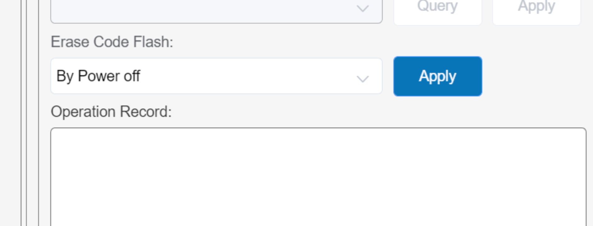

# FAQ - 常见问题

欢迎来到CH32H417Q开发板的常见问题页面。这里收集了一些开发过程中可能遇到的问题，以及对应的解决办法。

请先查看本页面的内容，若问题未解决，您可以到[WCH官方技术论坛](https://www.wch.cn/bbs/forums/tech.html)提问，一般会有专业的技术人员回复。

如果您需要通过邮件寻求帮助，请发送邮件至 support#xpulabs.com (将#替换为@)。

在邮件中包含以下信息：

- 问题描述
  - 相关截图（如果有）
  - 相关日志（如果有）
- 开发环境（如MounRiver Studio II IDE）
- 相关代码（如果有）

## FAQ001 - 到哪里下载开发板的SDK

您可以在WCH官方网站下载CH32H417Q开发板的SDK。

访问以下链接获取最新的SDK版本与技术手册：

- [WCH CH32H417Q SDK](https://www.wch.cn/downloads/CH32H417EVT_ZIP.html)
- [WCH CH32H417Q 技术手册](https://www.wch.cn/downloads/CH32H417RM_PDF.html)

推荐使用MounRiver Studio II作为开发环境，它提供了对CH32H417Q开发板的完整支持。

- [MounRiver Studio II IDE](https://www.mounriver.com/download.html)

## FAQ002 - 开发板第一次下载固件总是失败

当你收到板子后，想烧录一个点灯的程序，发现无论如何都烧录不了，这是为什么？

原因是已经烧录了USB3.0的测试程序，程序中会禁用SWD接口，因为这个PB8，PB9(SWDIO，SWCLK)是与USB3.0接口上HS的D+/D-是复用的。
所以在USB3.0程序初始化时使用下面的代码禁用了SWD接口。


```C
    /* Disable SWD */
    RCC_HB2PeriphClockCmd(RCC_HB2Periph_AFIO | RCC_HB2Periph_GPIOB, ENABLE);
    GPIO_PinRemapConfig(GPIO_Remap_SWJ_Disable, ENABLE);
```

解决办法：使用WCH LINK-E调试器将Code Flash擦除。
具体步骤如下：

1. 连接WCH LINK-E调试器到开发板的SWD接口，并通过调试器供电。
2. 打开MounRiver Studio II IDE，选择“下载”->“下载配置”
3. 在“Erase Code Flash”选项中，选择“By Power off”, 点击“应用”。下面对话框中会显示成功。
   
   
4. 拔掉WCH LINK-E调试器给开发板断电，然后重新连接调试器给开发板上电。
5. 再使用MounRiver Studio II IDE烧录固件，应该就可以成功了。

## FAQ003 - GPIO的电平为什么不对

CH32H417内部集成了可调输出电压的LDO，用于给VIO_18的网络供电，在XO脚上接下拉100K，会输出1.2V, 浮空会输出1.8V，接下拉330K，会输出2.5V.
可以通过软件来配置LDO的输出电压，具体方法如下：

```C
    RCC_HB1PeriphClockCmd(RCC_HB1Periph_PWR, ENABLE);
    PWR_VIO18ModeCfg(PWR_VIO18CFGMODE_SW);
    PWR_VIO18LevelCfg(PWR_VIO18Level_MODE3); // 输出3.3V
```

## FAQ004 - USB2.0 HS 接口为什么不能正常工作

原因是SWD接口的PB8，PB9是与USB2.0 HS接口的D+/D-是复用的，需要将LINK-E调试器拔下来，然后会进行正常初始化。如果插着LINK-E调试器，会在主机显示一个未知的USB设备。
