# Maple ESP32S31 Alef开发板使用手册

## 1. 产品介绍 - Overview

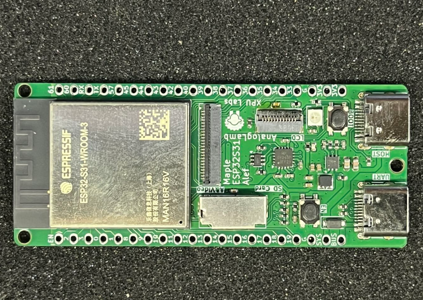

Maple ESP32-S31 Alef开发板是由XPU实验室设计，面向物联网爱好者、创客及嵌入式初学者的高性能入门开发板，集成最新 ESP32-S31 芯片与丰富外设，零门槛开启无线通信与智能硬件开发。

---

 **🔥 核心亮点**

- **RISC-V 双核 320MHz**：搭载乐鑫 ESP32-S31 芯片，RISC-V 32 位双核处理器，主频高达 320 MHz，性能强劲，轻松应对复杂任务。

- **超大存储**：512KB SRAM + **16MB PSRAM**​ + **16MB Flash**，运行大型程序、缓存图像、处理音频游刃有余。

- **Wi-Fi 6 + Bluetooth 5.4 + Zigbee/Thread**：支持最新 2.4GHz Wi-Fi 6（802.11ax）、Bluetooth 5.4 LE/Classic、Zigbee 及 Thread 多协议并发，覆盖智能家居、工业互联全场景。

- **ULP-RISC-V 协处理器**：超低功耗待机模式下仍可处理传感器数据，适合电池供电项目。

📦**丰富外设，即插即用**

| 接口/功能                | 说明                        |
| -------------------- | ------------------------- |
| **USB 2.0 Host**​ ×1 | 直接接入鼠标、键盘、U盘，拓展无限可能       |
| **SPI LCD 接口**​      | 轻松驱动 TFT 彩屏，显示仪表盘、游戏界面    |
| **I2C / I2S / DVP**​ | 接传感器、音频模块、摄像头（OV2640等）    |
| **SD 卡槽**（SDIO 总线）   | 大容量存储日志、媒体文件              |
| **CH343P USB-UART**​ | 自动下载电路，Type-C 一线烧录，告别手动复位 |
| **单线 RGB LED**​      | 状态指示、氛围灯效，编程友好            |
| **EN + BOOT 按键**​    | 调试/固件升级一键操作               |
| **1×20P 排针 ×2**​     | 引出所有 GPIO，兼容面包板与扩展板       |

**📐 紧凑设计**

- **尺寸 67×28mm**，比信用卡还小巧，可直接嵌入原型机或外壳。

- 板载天线，无需外接天线即可获得稳定无线信号。

**🚀 上手即用**

- 支持 **Arduino IDE**、**ESP-IDF**、**MicroPython**​ 等主流开发环境。

- 提供完整入门教程、示例代码、原理图。

- 社区支持：飞书群、论坛、B站视频教程，遇到问题随时求助。

**🎯 适合谁用？**

- **电子爱好者**：学习 RISC-V 架构、Wi-Fi 6、多协议通信。

- **创客/极客**：搭建智能家居网关、便携式仪表、桌面机器人。

- **嵌入式初学者**：从点灯到物联网项目，一本教材 + 一块板子搞定。

---

**XPU Labs 出品**​ — 专注为开发者打造高性价比、易上手的学习与原型平台。

👉 **淘宝搜索“Maple ESP32-S31 开发板”即刻拥有**

## 2. 芯片特点 - Features

ESP32-S31 是一款高性能双核 32 位 RISC-V 微控制器，主频高达 320 MHz，面向全面多协议连接，专为需要全面连接能力与丰富人机界面的先进物联网 (IoT) 应用而设计。芯片提供 60 个 GPIO，在同时支持多种无线协议、各类显示接口及多样化外设的复杂设计中，展现出卓越的灵活性。ESP32-S31 尤其适用于边缘侧 AI 与机器学习负载，包括神经网络推理、高级信号处理、计算机视觉与智能音频应用，同时保持嵌入式平台的高效特性。

芯片的功能框图如下图所示。

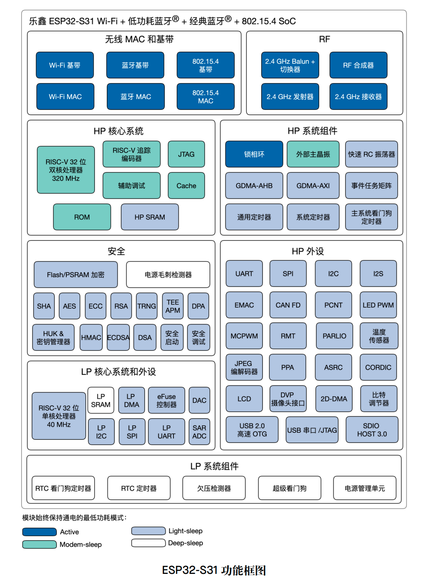

## 3. 产品规格 - Specifications

- **使用ESP32-S31-WROOM3模组**: 内置 ESP32-S31 芯片，RISC-V 32 位双核微处理器，支持高达 320 MHz 的时钟频率

- 支持ULP-RISC-V 协处理器，320 KB ROM，512 KB 共享 SRAM， **16MB PSRAM 和16MB Flash**

- 支持2.4 GHz Wi-Fi 6、Bluetooth® 5.4 (LE)、Bluetooth® Classic、Zigbee 及 Thread (802.15.4)等多种无线协议

- USB转UART芯片CH343P，支持自动下载电路

- USB2.0 Host接口 x1

- 支持I2C, I2S & DVP接口，可扩展音频与相机模块

- SPI LCD接口，可接TFT LCD显示屏

- 单线全彩RGB LEDx1

- SD卡接口，使用SDIO总线

- EN & BOOT按键，调试方便

- 两侧1X20P的排针，扩展性好

- 板子尺寸：67 x 28mm

## 4. 硬件开发 - Hardware

### ESP32-S31-WROOM3

ESP32-S31-WROOM-3 是通用型 Wi-Fi、Bluetooth® 5.4 (LE) Bluetooth® Classic 及 IEEE 802.15.4 MCU 模组，功能强大，具有丰富的外设接口，可用于嵌入式系统、智能家居、可穿戴电子设备等物联网场景。ESP32-S31-WROOM-3 采用板载 PCB 天线。

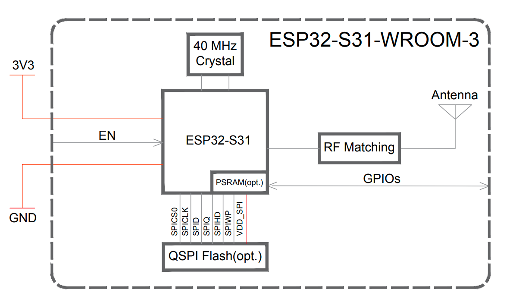

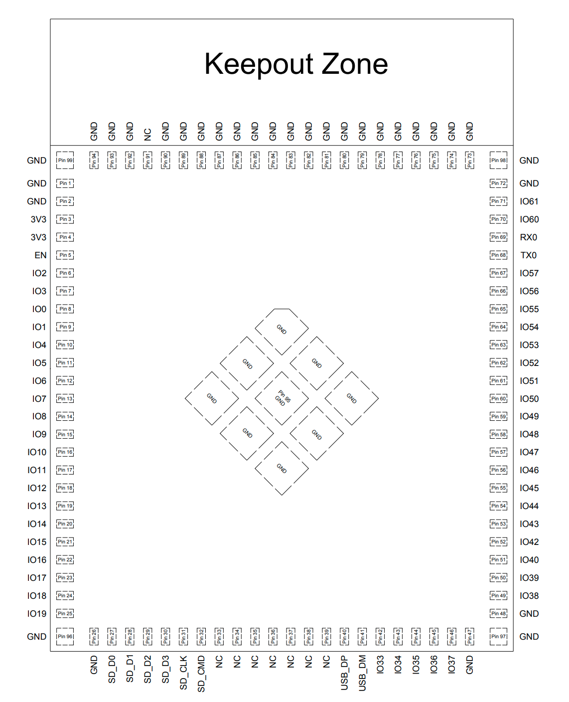

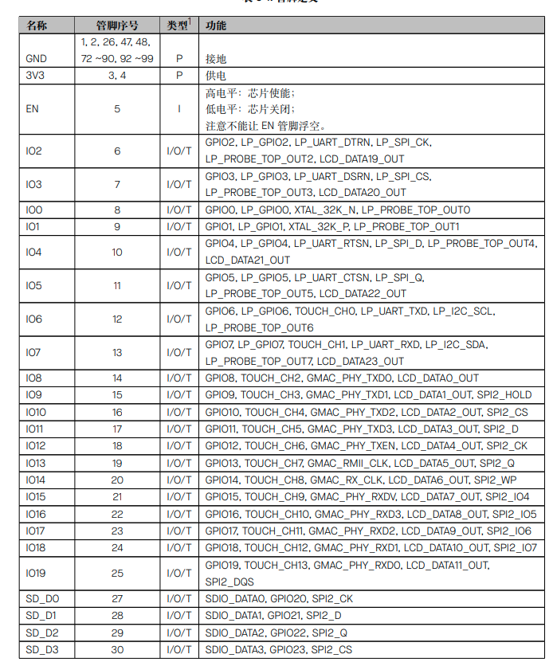


### 接口

**开发板框图**

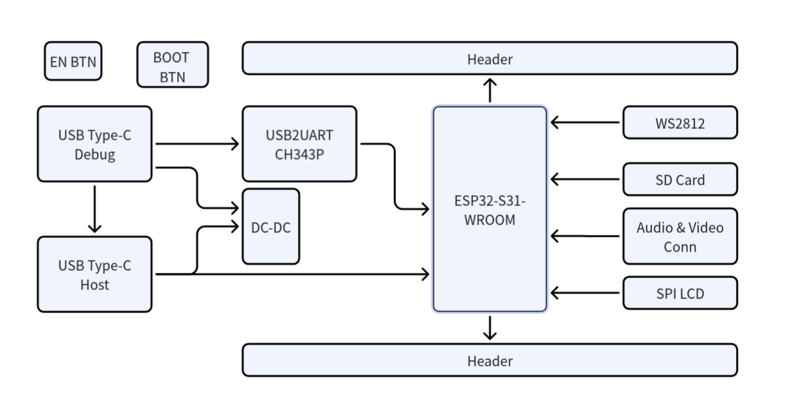

**主要接口**

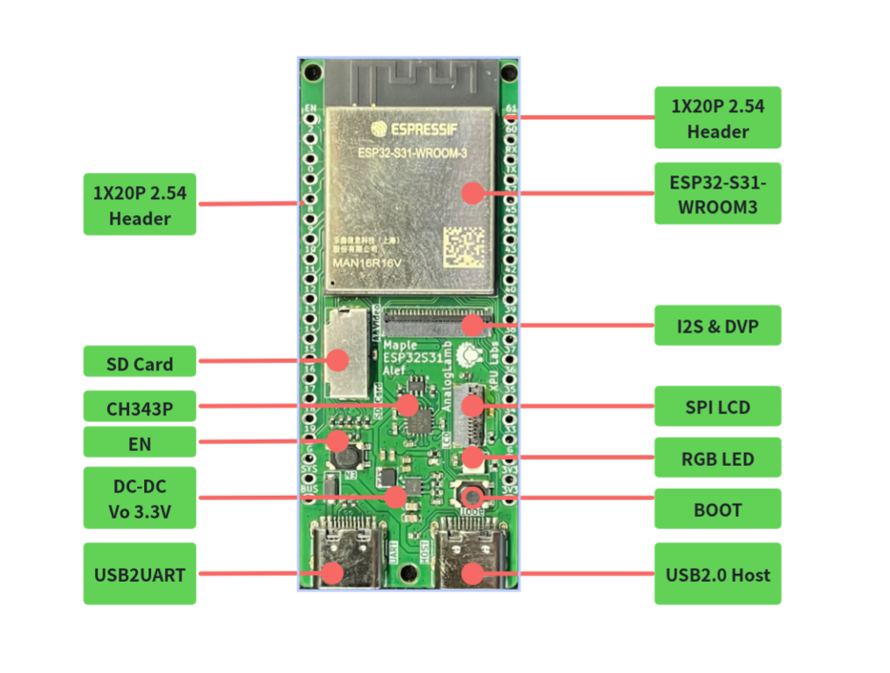

### 管脚定义

**音频与视频接口**

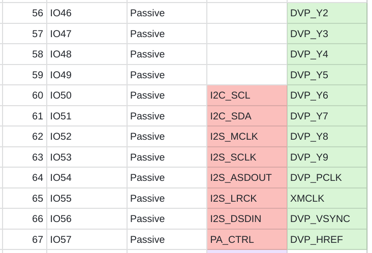


**SD卡接口**

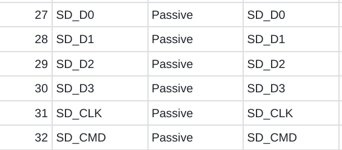

**USB Host**


**SPI LCD接口**

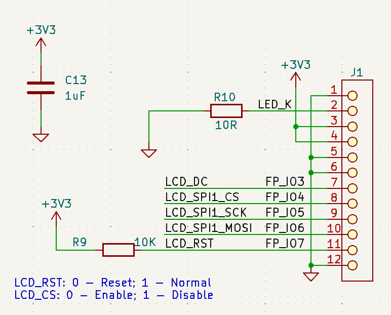

**RGB LED**


**两侧1X20P排针**

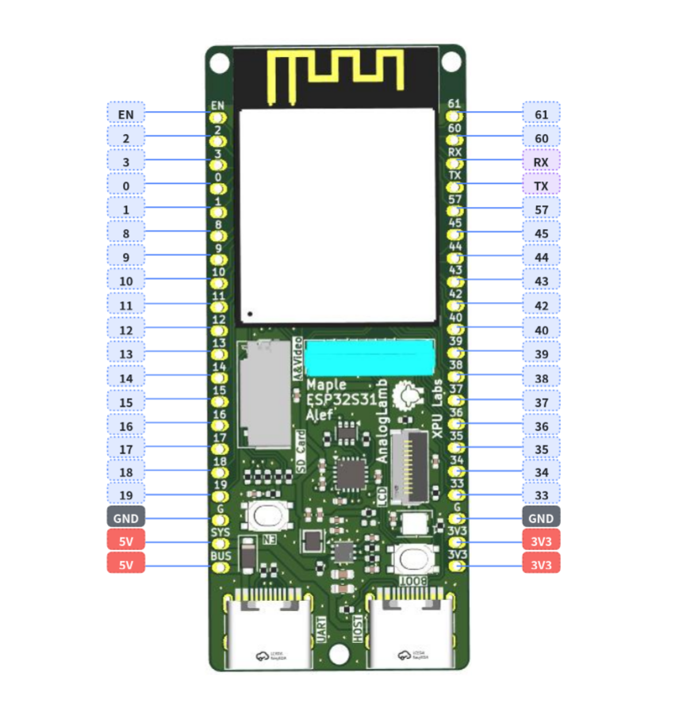

## 5. 软件开发 - Software

这块板子的核心是 **ESP32-S31-WROOM-3 模组**（16MB Quad SPI Flash + 16MB Octal SPI PSRAM，板载 PCB 天线），ESP32-S31 芯片本身双核 RISC-V @320MHz，带 USB 2.0 HS OTG、SDMMC、LCD_CAM、I2S、TWAI 等丰富外设，ESP-IDF master 分支对这些模块都已经提供支持 。

软件开发的整体思路是：**先搭对 ESP-IDF 环境（必须 master + preview）→ 跑通 hello world → 按外设分模块叠加功能**。下面按这条路线展开。

### 5.1 开发环境：必须用 ESP-IDF master

ESP32-S31 目前**只在 ESP-IDF master 分支上提供 preview 支持**，v6.1-beta1 才开始预发布，稳定版预期 v6.1.1 。用 release/v5.x 会直接报 `unknown target esp32s31`。

**安装（推荐用 EIM 命令行）**

```bash
# 1. 克隆 master
git clone -b master --recursive https://github.com/espressif/esp-idf.git ~/esp/esp-idf-master
cd ~/esp/esp-idf-master

# 2. 安装工具链（只装 esp32s31 的）
./install.sh esp32s31

# 3. 激活环境
. ./export.sh
```

Windows 用户可以用 EIM GUI 或在 PowerShell 里 `eim wizard` 交互安装，选择 ESP32-S31 芯片即可 。

**创建工程**

```bash
idf.py create-project my_s31_app && cd my_s31_app

# ⚠️ 必须加 --preview，否则按 ESP32 生成代码会出错
idf.py --preview set-target esp32s31

idf.py build
idf.py --preview -p /dev/ttyUSB0 flash monitor   # Linux
idf.py --preview -p COM3 flash monitor           # Windows
```

你这块板子带 **CH343P + 自动下载电路**，正常情况下直接 `idf.py flash` 就能下，不用手动按 BOOT。如果识别不到端口，按一下 EN 复位，必要时按住 BOOT 再上电，进 download 模式 。

### 5.2 menuconfig 关键配置

```bash
idf.py menuconfig
```

针对你这块 16MB Flash + 16MB PSRAM 的板子，必须改这几项：

| 配置路径                                               | 推荐值                    | 说明                   |
| -------------------------------------------------- | ---------------------- | -------------------- |
| **Component config → ESP32-S31 Specific → PSRAM**​ | Enable Octal PSRAM     | 16MB Octal SPI PSRAM |
| **Serial flasher config → Flash size**​            | 16 MB                  | 匹配模组                 |
| **Partition Table**​                               | Custom 或 Factory 12MB+ | 16MB Flash 需要合理分区    |
| **Component config → FreeRTOS**​                   | 双核调度                   | 双核 RISC-V            |

PSRAM 启用后，代码中可用 `MALLOC_CAP_SPIRAM` 标记的大块内存都会自动分配到 PSRAM，对 LCD 帧缓冲、音频缓冲、AI 模型推理非常关键。

### 5.3 按外设分模块开发

参考 ESP32-S31-Korvo-1 这类官方板卡的 bring-up 经验 ，建议按以下顺序叠加功能：

**1. 基础：Hello World + GPIO + RGB LED**

单线全彩 RGB LED 通常用 RMT 外设驱动 WS2812 协议：

```bash
# 参考 Korvo-1 的 WS2812 示例（GPIO37）
idf.py --preview set-target esp32s31
```

具体 GPIO 以**你这块板子的原理图/排针丝印为准**——搜索结果里没有你这款 exact 板子的 pinout，不要盲目套用 Korvo-1 的 GPIO37。

**2. SPI LCD（你板子的重点）**

ESP-IDF master 对 **SPI LCD driver**​ 已提供完整支持 。240x240 ST7789 屏的例子上一轮已经聊过，套路是：

- 用 `esp_lcd` 组件 + `esp_lcd_st7789` 组件
- 通过 `menuconfig` 选控制器为 ST7789
- 在代码里指定 SCLK/MOSI/DC/RST/CS 引脚（**查你板子原理图**）
- RGB565 帧缓冲建议放 PSRAM

**3. SDIO SD 卡**

ESP32-S31 的 **SDMMC Host driver 支持 UHS-I**，SDSPI 也支持 。1-bit 模式最小接 CLK/CMD/D0 三根线 + 上拉电阻。参考我上一轮给你的 `sdmmc_host_init_slot()` 调用顺序，那个 null pointer assert 就是没按 master 的正确顺序初始化导致的。

**4. USB 2.0 Host**

ESP32-S31 的 **USB Host driver 支持 USB 2.0 Host**​ 。你板子上的 USB Host 接口可以接鼠标键盘、U 盘、USB 音频等。开发时用 TinyUSB 的 host 例程：

```bash
# 在 esp-idf/examples 里找 peripheral/usb 相关例子
```

**5. 无线协议栈**

这是 ESP32-S31 的强项，**Wi-Fi 6、Bluetooth 5.4 (LE + Classic)、802.15.4 (Zigbee/Thread/Matter)**​ 在 master 上都已支持 ：

- **Wi-Fi**：`examples/wifi` 下 getting_started、scan、sta 等
- **BLE**：`examples/bluetooth/nimble` 或 bluedroid
- **Classic BT A2DP**：参考 Korvo-1 的 A2DP Sink 示例
- **Zigbee/Thread/Matter**：用 ESP-Matter SDK（基于 ESP-IDF master）

**6. I2C/I2S/DVP**

- I2C：master/slave driver 都支持
- I2S：STD/TDM/PDM 模式齐全，做音频编解码
- DVP 摄像头：LCD_CAM DVP 已支持

### 5.4 推荐的开发路线

```
Week 1: 环境搭建 + hello world + GPIO 点灯
Week 2: SPI LCD 点亮（最直观的反馈）
Week 3: Wi-Fi/BLE 基础通信
Week 4: SD 卡读写 + PSRAM 大缓冲
Week 5: USB Host 外设
Week 6: 综合应用（比如：USB 摄像头 → PSRAM → LCD 显示）
```

## 6. 教程 - Tutorials

## 7. 资源 - Resources

- [ESP32-S31-WROOM-3规格书](https://documentation.espressif.com/esp32-s31-wroom-3_datasheet_cn.pdf)

- [ESP32-S31芯片规格书](https://documentation.espressif.com/esp32-s31_datasheet_cn.pdf)

- [ESP32-S31文档](https://esp32-s31.espressif.com/en/docs)

## 8. 例程 - Examples

- LED Blink

- SPI LCD Display

- SD Card Test

## 9. 常见问题 - FAQ
